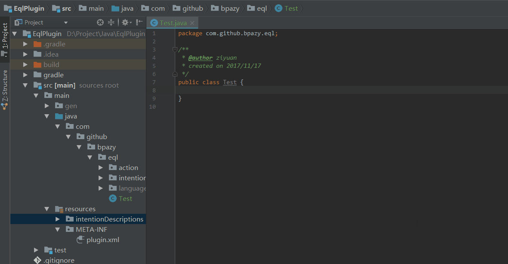
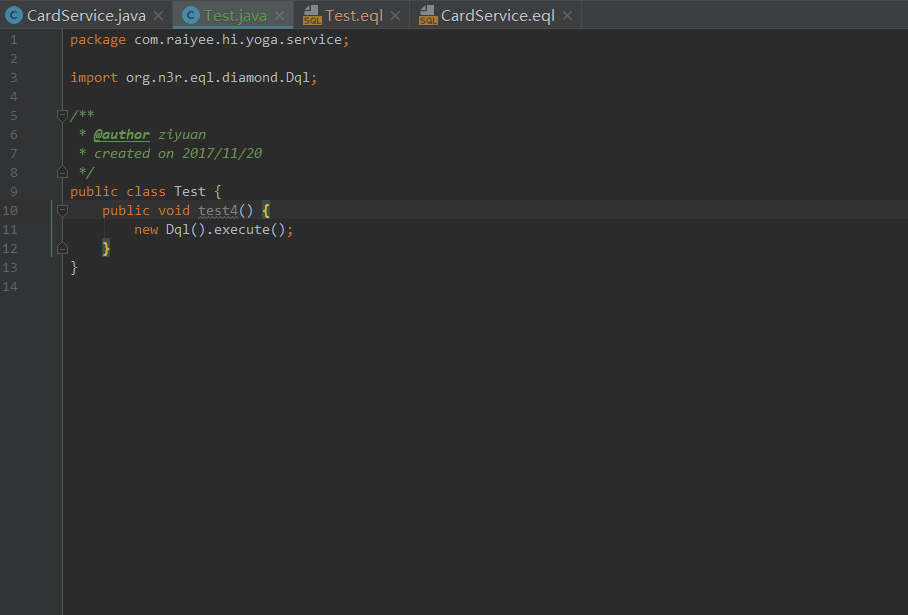

# EQL

## 下载

 安装eql-plugin `Intellij IDEA`或[https://plugins.jetbrains.com/plugin/10169-eql-plugin](https://plugins.jetbrains.com/plugin/10169-eql-plugin)

### 使用

**生成EQL文件：Generate code（默认：Windows系统：Alt+insert，Mac上⌘N）**

**转到Java的或者EQL方法：Quick fix（默认：Windows系统：Alt + Enter，Mac上⌥↵）**

